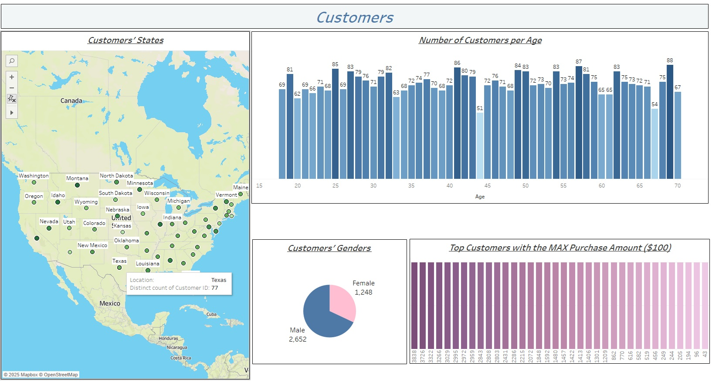

## Consumer Behavior and Shopping Habits Dataset Analysis 


- This project presents a Tableau visualization for analyzing the [Consumer Behavior and Shopping Habits Dataset](https://www.kaggle.com/datasets/zeesolver/consumer-behavior-and-shopping-habits-dataset?select=shopping_behavior_updated.csv) from Kaggle. 
---

### Project Overview

- **Goal**: Analyze the Consumer Behavior and Shopping Habits Dataset using visuals in Tableau Desktop. The csv file was uploaded into Tableau Desktop via the connect 'To a file' functionality, and the visuals were created.

---

### Dashboards Created:


- The first dashboard shows the Number of Customers by each State on the map visual (the darker green colors mean the larger number of customers). A column chart displays the distribution of Customers by their Age (the minimum age is 18, and the maximum is 70). The number of Male customers prevails in the dataset (slightly more than twice). Also, the customers' IDs with the largest total Purchase value are shown in the column chart (purchase value equals 100 USD).


 


-  The second dashboard displays the information about available Categories and Items. Four categories are present in the dataset. The total Revenue has the largest value for the Clothing category (11 items available in general for this category). Then the visual shows the number of times each item was bought per Gender. In general, 'Pants' are the most sold item.
Additionally, a chart was created to analyze the demand of each item per season.


 

- The third dashboard provides an opportunity to track patterns in combinations of Colors and Items. Also, the sizes for each Item by Gender are supplied in the second visual.


 


-  The next dashboard is helpful to investigate the Ratings for each available Item (the 'Glows' item is the Top 1, and the 'Shirt' has the smallest Rating score). Total Revenue and Average Number of Purchases per State are shown in other charts.


 


- The fifth dashboard presents the number of Customers by Frequency of Purchases, where the most popular frequency is 'Every 3 months'. There are six Payment methods used approximately the same number of times by Customers. Only 1053 Male Customers are subscribed, and they all use Promo codes and Discounts. Unsubscribed Female Customers do not use any Promo codes or Discounts, while part of the unsubscribed Male Customers use these opportunities. Additionally, the dashboard features a visual representation of six shipping types categorized by type.


 


---


## Setup Instructions

### Clone this Repository
```bash
git clone https://github.com/marianaprytula/Consumer_Behavior_and_Shopping_Habits_Dataset_Analysis.git
```